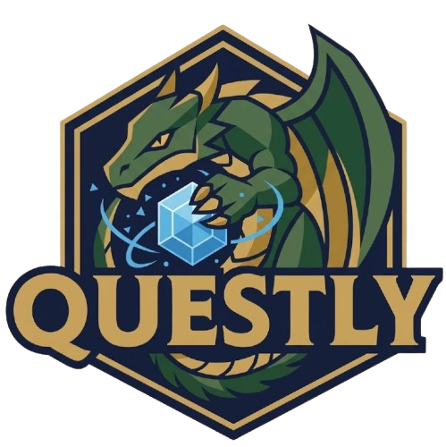

# Questly — Fantasy Prompt Engineering Platform

> Learn prompt engineering through daily fantasy missions, evaluated by AI.

<p align="center">
  
</p>

---

## What is Questly?

Questly is a gamified web platform that teaches **prompt engineering** and **GenAI** skills through immersive daily missions set in a fantasy world. Each day, a new mission challenges you to craft the perfect prompt — the AI evaluates your work across 5 dimensions and awards XP.

| | |
|---|---|
| **Stack** | Next.js 15 (App Router) + TypeScript |
| **Styling** | Tailwind CSS 4 |
| **Animations** | Framer Motion 11 |
| **AI Evaluation** | Mock (Gemini / Cloudflare AI ready) |
| **Missions** | 365 daily missions (full year coverage) |

---

## Features

### Fantasy World
- Illustrated village that transforms between **dawn** (light mode) and **night** (dark mode)
- Smooth crossfade transition with shooting star (light→dark) and sun burst (dark→light) animations
- Twinkling stars and ambient glow effects

### Daily Mission System
- One mission per day — deterministic rotation, same for all users
- **365 missions** across 8 categories:
  - `prompt-basics` · `context-crafting` · `chain-of-thought` · `role-prompting`
  - `few-shot` · `output-formatting` · `multimodal` · `agents`
- Difficulty 1–5 stars · Weekend missions are harder (difficulty 4–5)
- Fantasy narrative + concrete task + hints

### AI Evaluation
- Submit your prompt → scored on 5 dimensions (0–100 each):
  - **Creativity** · **Precision** · **Context** · **Structure** · **Prompt Engineering**
- Narrative feedback + improvement suggestions
- XP awarded based on score × difficulty

### Gamification
- User profile with nickname, XP, level, streak
- 8 trophies (first mission, week streak, arcane engineer, mythic builder...)
- Badge system: Apprentice → Prompt Knight → Arcane Engineer → Mythic Builder
- World unlock system: village evolves with your progress
- Leaderboard (mock top-10)

---

## Project Structure

```
src/
├── app/
│   ├── page.tsx              # Main page (50/50 village + mission)
│   ├── layout.tsx            # Root layout + theme init
│   ├── globals.css           # Tailwind + custom CSS vars
│   └── api/
│       ├── mission/route.ts  # GET /api/mission
│       └── evaluate/route.ts # POST /api/evaluate
├── components/
│   ├── fantasy-world/        # VillageScene, ThemeToggle, AmbientEffects
│   ├── mission-system/       # MissionCard, MissionInput, EvaluationResult
│   ├── ui/                   # Button, StarRating, ScoreDisplay, XPBar, BadgeDisplay
│   ├── profile/              # ProfileHeader, TrophyNotification
│   ├── auth/                 # NicknameSetup modal
│   └── leaderboard/          # Leaderboard component
├── lib/
│   ├── daily-mission.ts      # Deterministic daily rotation
│   ├── evaluate.ts           # Mock AI scorer (5 heuristic dimensions)
│   ├── missions.ts           # Mission accessors
│   ├── auth.ts               # localStorage profile management
│   ├── progression.ts        # XP, level, trophy engine
│   ├── badges.ts             # Badge system
│   └── worldUnlocks.ts       # Village unlock logic
├── data/
│   └── missions.json         # 365 fantasy missions
└── types/
    └── index.ts              # TypeScript interfaces
```

---

## Getting Started

### Prerequisites
- Node.js 18+ 
- npm / yarn / pnpm

### Install & Run

```bash
# Clone
git clone https://github.com/michelesanfilippo/questly.git
cd questly

# Install dependencies
npm install

# Start dev server
npm run dev
```

Open [http://localhost:3000](http://localhost:3000).

### Build for production

```bash
npm run build
npm start
```

---

## Deployment

### Vercel (Recommended — zero config)

```bash
npm i -g vercel
vercel
```

Or connect the GitHub repo at [vercel.com](https://vercel.com):
1. New Project → Import `michelesanfilippo/questly`
2. Framework: Next.js (auto-detected)
3. Deploy — live in ~60 seconds

### Netlify

```bash
npm run build
# Deploy `out/` directory or connect GitHub repo
```

### Docker

```dockerfile
FROM node:20-alpine
WORKDIR /app
COPY package*.json ./
RUN npm ci
COPY . .
RUN npm run build
EXPOSE 3000
CMD ["npm", "start"]
```

---

## Upgrading AI Evaluation

The mock evaluator in `src/lib/evaluate.ts` is designed for a single-function swap:

```typescript
// Replace the mock with Gemini:
import { GoogleGenerativeAI } from '@google/generative-ai';

export async function evaluatePrompt(userPrompt: string, mission: Mission): Promise<EvaluationResult> {
  const genAI = new GoogleGenerativeAI(process.env.GEMINI_API_KEY!);
  // ... call Gemini, parse response into EvaluationResult shape
}
```

---

## Roadmap

| Phase | Feature | Status |
|---|---|---|
| MVP | Daily missions + AI evaluation | Done |
| Post-MVP | Auth + profile + progression + trophies | In Progress |
| v2 | Real database (Supabase / PlanetScale) | Planned |
| v2 | Google / Microsoft / Apple OAuth | Planned |
| v2 | Gemini API evaluation | Planned |
| v3 | Social leaderboard + friends | Planned |
| v3 | Mission creation by community | Planned |

---

## License

MIT
